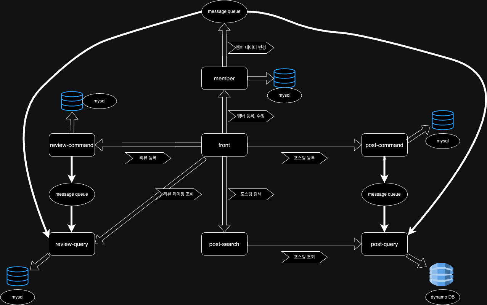

# msa-dashboard

간단한 게시판 서비스를 MSA로 구축해보는 멀티모듈 프로젝트입니다. 
회원(member), 게시판 등록(post-command), 게시판 조회(post-query),
게시판 검색(post-search), 리뷰 등록(review-command), 리뷰 조회(review-query),
메세지(message), 화면(front) 이렇게 총 8개의 서비스로 구성되어 있으며, 각각의 독립적인 프로젝트로 구성되어 있습니다.

front 서비스를 제외한 모든 서비스는 기본적으로 Hexagonal Architecture로 구현하고, 일부 서비스에서는
Event Sourcing, CQRS, Saga Pattern 등이 적용되어 있습니다. 

## Overall Architecture for Monolithic System

## member-service
고객의 회원 가입, 회원 정보 변경, 회원 정보 조회 등의 기능을 제공하는 서비스입니다. 뿐만 아니라 회원 서비스에서 멤버에 대한 인증, 인가 기능도 제공하고 있습니다.
### 주요 로직
- front service에서 멤버에 대한 회원가입, 로그인에 대한 요청을 처리합니다. 
- 멤버 정보가 변경되면 review-query, post-query 서비스와 싱크를 맞추기 위해서 멤버의 id를 메세지 큐에 넣습니다. 그리고 다른 서비스는 메세지의 큐의 id로 멤버 서비스에 변경된 멤버 데이터에 대해 요청합니다.
### API list
- existDuplicatedEmail: 멤버의 중복 이메일 체크

### post-command-service
### post-query-service
### post-search-service
### review-command-service
### review-query-service
### message-service
